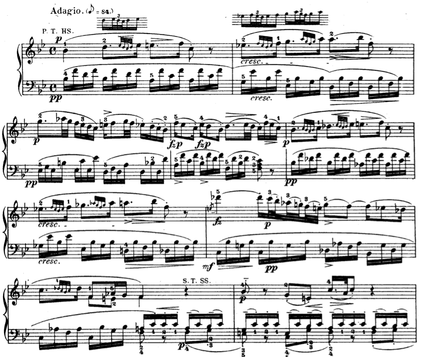

## Compound period ##

The compound period (also called the *16-bar period* because its typical form is 16 bars long), is made of two themes instead of two phrases. Just as in a regular [period](period.html), the first theme ends in a weak cadence (most often HC) and the second theme ends in a strong(er) cadence (most often PAC). Also like in a regular period, the two themes begin with the same basic idea (BI), possibly with some variation between the two.

The themes that are used to make the compound period have the same characteristics as they normally do, with the exception that the need for a weak cadence at the end of the first theme and a strong cadence at the end of the second theme may override the typical cadence patterns of those themes when they occur in isolation.

The first type of compound period is comprised of two sentences: the first ends with an HC or (less frequently) an IAC, and the second ends with a PAC.

[![][16period-sent]][16period-sent]

A prototypical example of a compound period composed of two sentences is Mozart's Piano Sonata in F major, K. 332, II., mm. 1–8. 

Note that because of the slow tempo, this "16-bar" period is notated as only eight bars. Also, note that though the theme modulates, the second cadence, a PAC in the key of the dominant, is stronger than the first cadence, a HC in the home key. For the purposes of antecedent-consequent relationships, a PAC is always stronger than a HC or IAC, even if it is in another key.

Similarly, a compound period can be comprised of two Hybrid 1 themes (antecedent–continuation) 

[![][16period-hybrid1]][16period-hybrid1]

or two Hybrid 3 themes (CBI–continuation).

[![][16period-hybrid3]][16period-hybrid3]

## Compound sentence ##

The compound (or 16-bar) sentence expands both the presentation and continuation phrases of a regular [sentence](sentence.html) to a typical length of eight bars each. 

Each (2-bar) basic idea (BI) of the presentation phrase is replaced by a (4-bar) compound basic idea (CBI) in the expanded presentation. The resulting (typically 8-bar) presentation still has no cadence, but simply prolongs tonic.

The expanded continuation phrase is somewhat looser in proportion and in length. A "typical" continuation in this theme would have approximately four bars of continuation function followed by four bars of cadential function (an expanded cadential progression).

[![][16sent]][16sent]

A prototypical example of a compound sentence is Mozart's [Trio for Piano, Clarinet, and Viola, K. 498](http://erato.uvt.nl/files/imglnks/usimg/3/32/IMSLP65681-PMLP133432-Mozart_Werke_Breitkopf_Serie_17_KV498_Piano.pdf), I., mm. 1–16.

Note that *bar length is not the important issue* when deciding whether a theme is a regular sentence or a compound sentence. Sometimes a regular sentence is written down in a fast duple meter, and it takes up 16 bars. At other times, a compound theme is set to such a slow tempo that it takes only 8 bars (like the compound period in Mozart's K. 332, above). The key difference between the regular sentence and the compound sentence is that the regular sentence begins with two basic ideas and the compound sentence begins with two *compound basic ideas*. Even that distinction will, at times, seem like splitting hairs, though at other times it will be quite obvious. Use your best judgment based on the musical features that you find to be the most salient.

[16period-sent]: Graphics/ClassicalThemes/16period-sent.png
[16period-hybrid1]: Graphics/ClassicalThemes/16period-hybrid1.png
[16period-hybrid3]: Graphics/ClassicalThemes/16period-hybrid3.png
[16sent]: Graphics/ClassicalThemes/16sentence.png

