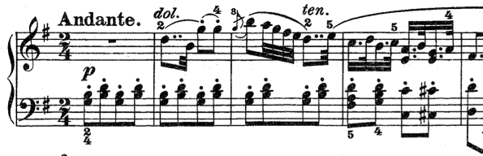
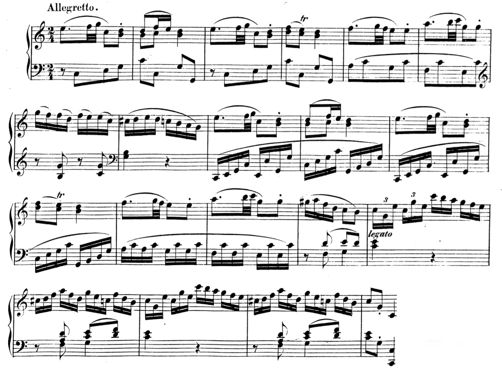
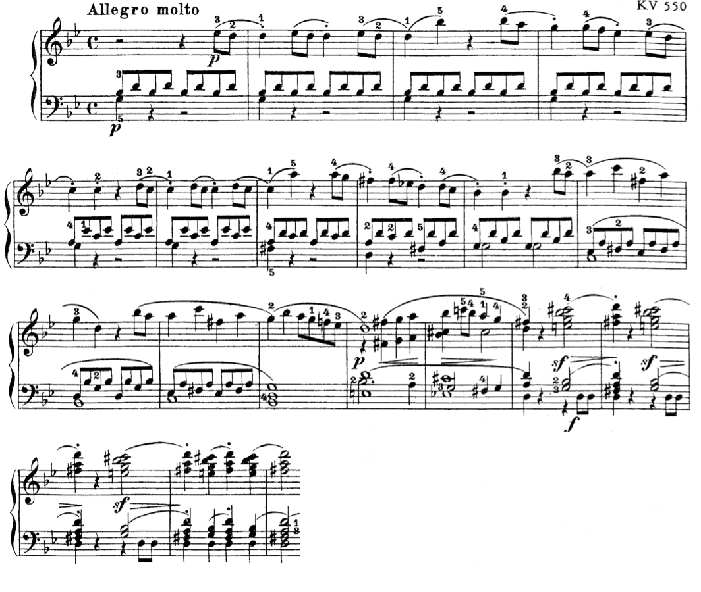

Often, a theme is surrounded by material that exists outside its boundaries, but which is clearly dependent on the theme itself. This function of this material is **external* to the theme itself— “before-the-beginning” or “after-the-end," as William Caplin as termed it.

## Prefix ##

An *prefix* is a passage—short or long—that *precedes* a theme. Prefixes most often lack distinct motivic material and/or a harmonic progression. Simple accompanimental figurations are common. Therefore, while connected to the following theme, when removed, they do not disturb the logic of the phrase itself. One might analogize these passages with the dependent clause that begins many sentences. 

**Haydn, Symphony No. 101, "Clock"** 

<iframe src="https://embed.spotify.com/?uri=spotify:track:3JlbelZisTTwEh6e13uRyQ" width="300" height="80" frameborder="0" allowtransparency="true"></iframe>

Here, a one-measure accompanimental prefix sits in front of a four-measure antecedent phrase, which begins in m. 2. As is common, this introduction lacks consists of a simple accompanimental figuration, "setting up" the theme that follows.

## Suffix ##

Generally, the function of a suffix is to prolong the harmony that closed the theme. Suffixes are described, and given different names, according to what kind of cadence, PAC or HC, ends the theme.

*Closing sections,* sometimes called *codettas*, follow themes that end with PACs. Like *prefixes,* suffixes vary in length.

**Mozart, Piano Sonata in C major, K. 330** 

<iframe src="https://embed.spotify.com/?uri=spotify:track:3ZlIXdp94i6qpfox8Su6Ll" width="300" height="80" frameborder="0" allowtransparency="true"></iframe>

In this example (from Mozart's Piano Sonata, K. 330), a [compound period](compoundThemes.html) initiates the theme and ends with a PAC in m. 16. Following the PAC, a five-measure *closing section* confirms the cadence. Notice that the melody is centered around scale degree 1—a common feature of these passages—and that harmonically the ii–V-I cadential progression that ended the theme (see m. 15 and 16) is simply repeated.

When a *suffix* follows an HC, it is called *standing on the dominant*. These passages, full of expectation, are often signals for thematic entrances (such as the second theme of a sonata form movement) or thematic returns. 

**Mozart, Symphony No. 40, K. 550, i**

<iframe src="https://embed.spotify.com/?uri=spotify:track:04zau0E0VspgiqNvTqCO7u" width="300" height="80" frameborder="0" allowtransparency="true"></iframe> 

This famous example (from the first movement of Mozart’s Symphony No. 40) begins with a one-measure introduction followed a compound sentence. The compound sentence ends with a half cadence in m. 16. (Notice the augmented sixth chord that precedes it.) The succeeding measures *stand on the dominant,* prolonging the cadence by emphasizing dominant harmony with scale degree 5 embellished melodically.
