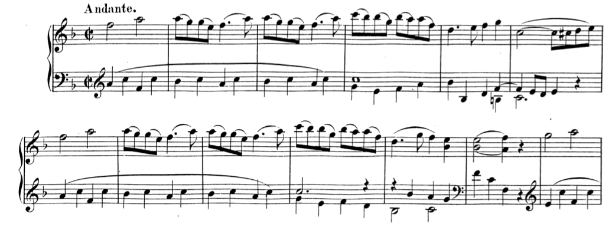
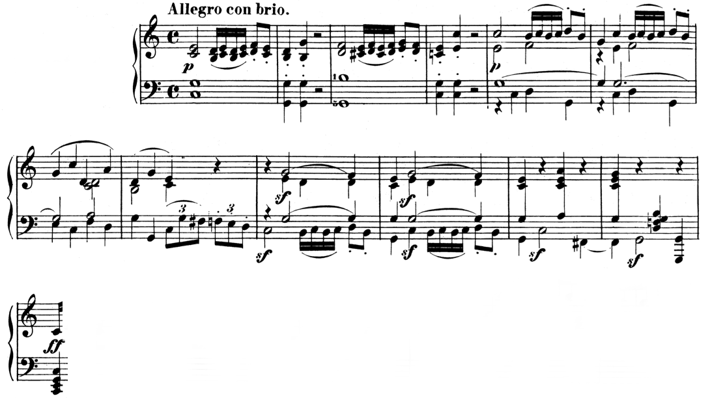
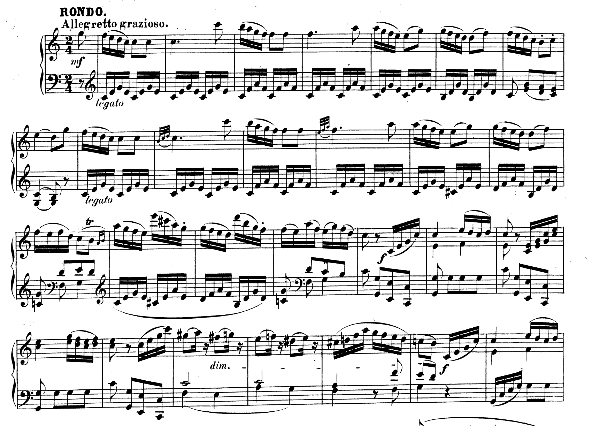

For historical reasons, and perhaps biological ones as well, the length of sub-phrases and phrases are generally duple. But plenty of classical music displays irregular lengths. This topic has been the subject of a great deal of musical theoretical exploration, for more than two centuries. Those interested will find a great deal more about *expansion* and *compression* in writings by William Rothstein, William Caplin, Janet Schmalfeldt, and Dinuta Mirka, among many others. 

Here, we will concentrate on a simple, common type of expansion. These expansions occur when a sub-phrase or phrase is made larger through simple repetition *within itself.* Notably, irregular sub-phrase and phrase lenghts are not always the result of expansion. When in doubt, try to recompose the passage in question without destroying its melodic, harmonic, and motivic structure. If you can, there is a case to be made that an *expansion* is present.

##Sub-phrase Expansion##

When a two-measure basic idea or contrasting idea is expanded, it is most often accomplished through simple "echo repetition": a motive or other small melodic figure is repeated, either exactly or with simple embellishment, causing the overall length of the sub-phrase to be larger than the expected two measures.  

**Mozart’s Rondo in F, K. 494** 

	
<iframe src="https://embed.spotify.com/?uri=spotify:track:78LK9tbF0jwOd4PYtk42WD" width="300" height="80" frameborder="0" allowtransparency="true"></iframe>
	
Mozart's Rondo in F begins with a simple period. A HC in m. 6 is followed by a consequent phrase that ends with a PAC in m. 12. The theme’s exceptional length is caused in part by an *expansion* of the initial basic idea: in m. 3, the piano repeats m. 2. One could imagine a simple recomposition of the passage, omitting m. 3, that would restore the sub-phrase to its normative length.

The contrasting idea that comprises the three remaining measures of the antecedent phrase are different. While longer than we expect, it is *less clear* if its greater length is due to *expansion.* There is *no echo repetition,* for example. Perhaps Mozart made the contrasting idea three measures simply to match the expanded basic idea. Or, we might consider this a contrasting idea that has been expanded through "composed-out deceleration." Notice that the rhythmic values in the right hand slow markedly in m. 5. If they'd continued the steady stream of eighth notes from m. 4, the cadence could have been achieved a measure earlier.

##Phrase Expansion##

Like sub-phrase expansion, phrases are generally expanded through repetition. Most often, this repetition happens in the terminating phrase of a theme (either consequent or continuation). Such expansions are quite expressive because they delay the expected cadence.
		
**Beethoven, Piano Sonata, Op. 2, No. 3** 

	
<iframe src="https://embed.spotify.com/?uri=spotify:track:5wi0p2gHWFYSwnjgHSYEP3" width="300" height="80" frameborder="0" allowtransparency="true"></iframe>
	
In this example, measure 1–8 create a sentence whose basic idea is fragmented in m. 5–6. At the moment of expected cadence in m. 8, an IAC emerges instead of a PAC. Subsequently, the entire continuation is repeated, thus *expanding* the continuation phrase to nine bars in total.

Note that it is lack of *satisfactory cadential closure* that gave rise to the expansion. This is the most common musical reason for phrase expansions. In addition to IACs, deceptive cadences can motivate expanded phrases, as well. In many other examples, an expected cadence never materializes at all. In these passages, the cadence has been *evaded.* When an evaded cadence is followed by the repetition of a phrase, the expansion is an example of what Janet Schmalfeldt has termed the "one more time" technique. 

**Mozart, Piano Sonata, Piano Sonata in C major, K. 309, iii**

<iframe src="https://embed.spotify.com/?uri=spotify:track:7DsGTbl7EABrY5GK6Dza9P" width="300" height="80" frameborder="0" allowtransparency="true"></iframe>

Following an 8-measure sentence ending with a half cadence, a parallel sentence begins in m. 9. We expect this sentence to conclude in m. 16 with a PAC, creating a large compound period. But the latter phrase *does not* end with a PAC. Rather, the expected cadence in m. 16 never materializes. Instead, the cadence is *evaded,* and the entire continuation phrase is repeated "one more time," concluding with a PAC in m. 19. 

