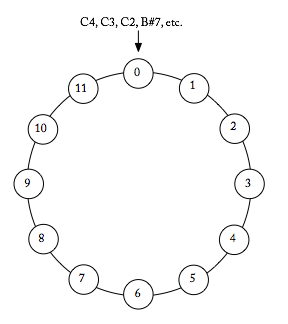

{{ page.title }}
================

Once we assume octave and enharmonic equivalence, our pitch-class environment becomes very small: only twelve unique pitch class. In this universe, modular arithmetic is a very useful way to imagine getting around.

Modular arithmetic is like regular arithmetic, except that the numbers “wrap around” or restart when they reach a certain value—the *modulus*. Counting in a *mod 12* universe works just as in basic math ["1, 2, 3, ..."], but after 11, we “begin again” at 0. Conversely, when counting down ["10, 9, 8, ..."], we 0 leads to 11. 

While we are used to thinking of numbers on an infinite line, modular thinking wraps them into a finite number, generally represented by a circle. On this circle, all values are a number from 0 to 11.

**Pitch-Class Space**

##Addition and Subtraction##
To add or subtract in mod 12, perform the calculation in the usual manner (7 + 15 = 22) and then add or subtract 12′s until you get a number from 0 to 11 (22 - 12 = 10).

Adding and subtracting can represent many musical ideas: moving seven half steps above D takes you to A (2 + 7 = 9); combining 2 half steps and 11 half steps produces 1 half step (2 + 11 = 1).

Modular arithmetic is a quick way to calculate various intervals between pitches or pitch classers. Some examples:

What is the interval class from pitch class 7 (G) to pitch class 10 (B-flat)? 10 - 7 = 3
What is the pitch class 5 semitones above B-natural (11)? 11 + 5 = 4. That is, E.

 

